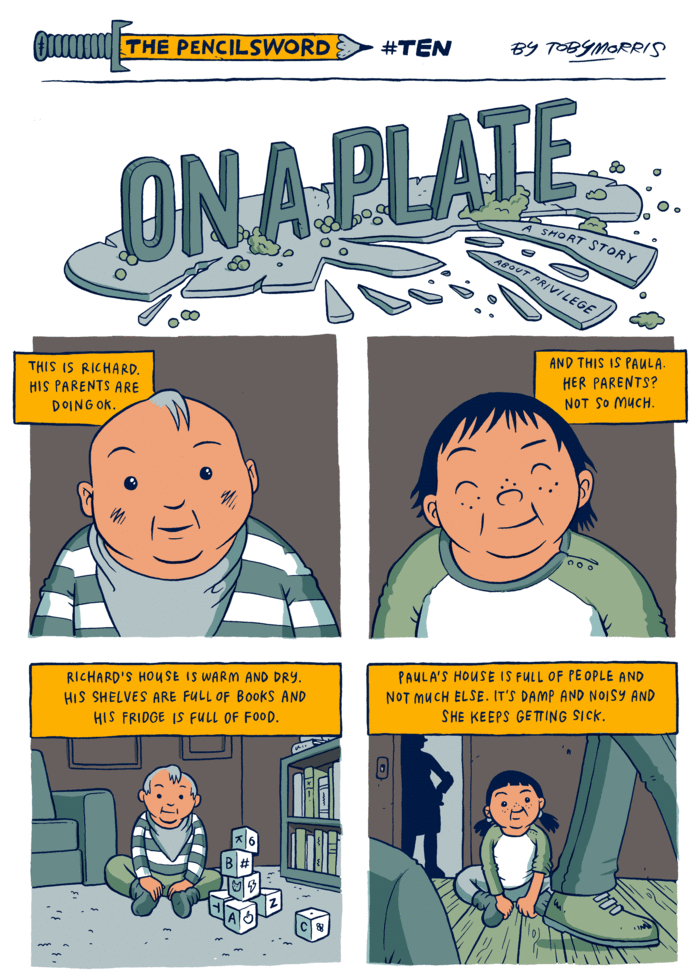
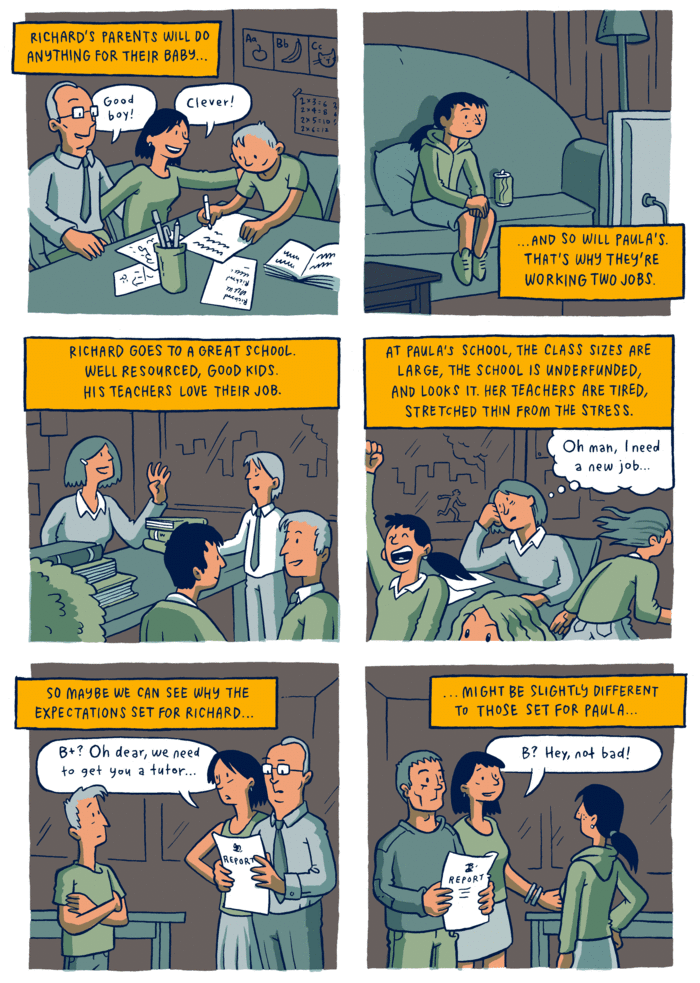
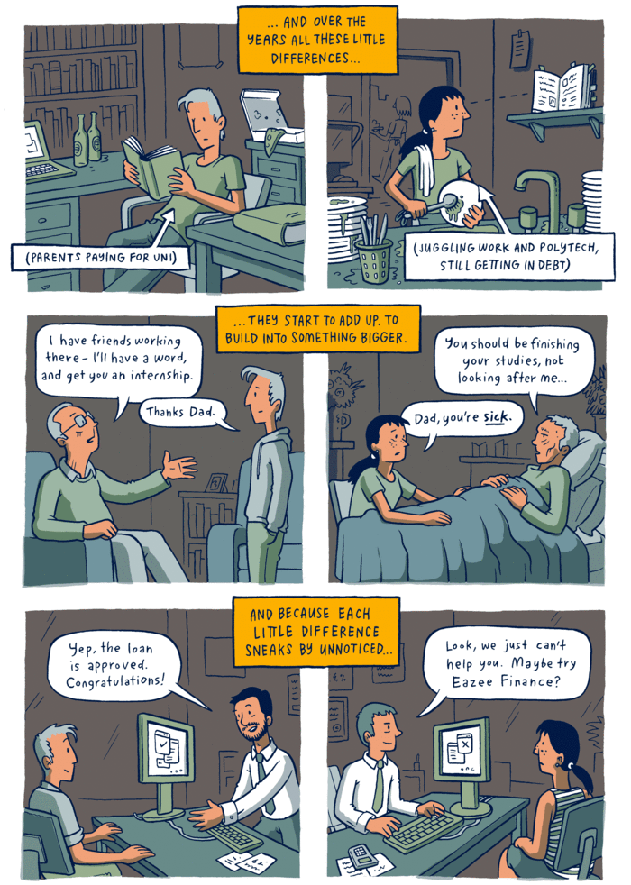
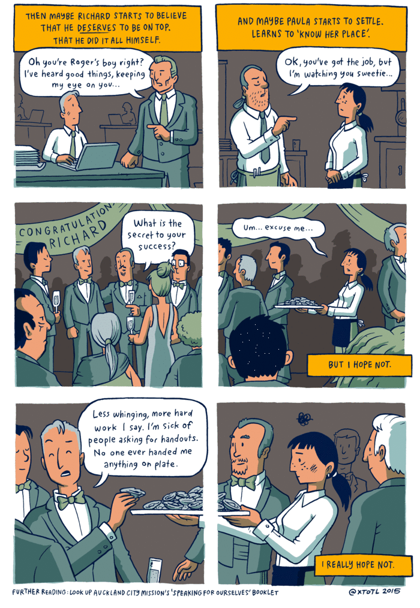

Cloned from [Word on the Streets](https://www.wordonthestreets.net/Articles/569596/On_a_plate.aspx) in an attempt to perpetuate a comic strip by [Toby Morris](https://en.wikipedia.org/wiki/Toby_Morris_(cartoonist)).

> Some folk have perhaps had a helping hand in life while others weren’t given such assistance. You can’t blame people for being given opportunities, but it’s always good to realise how the other half lives and to help those who are not that fortunate.
>
> The comic below is a short story called “On A Plate” by illustrator Toby Morris. Its message explaining what not recognising what privilege is, is pretty powerful.

